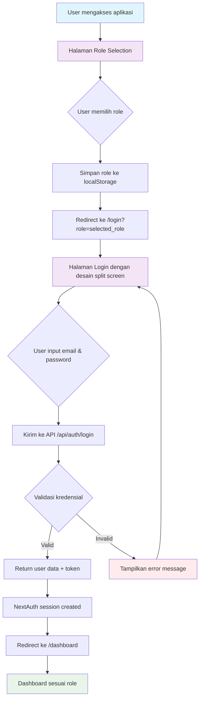

# Login Flow Diagram

## Penjelasan Flow:

1. **Role Selection** - User memilih dari 6 role yang tersedia
2. **Login** - User login dengan email/password sesuai role
3. **Validation** - Sistem validasi kredensial dan role
4. **Dashboard** - Redirect ke dashboard sesuai role yang dipilih

## Role-based Access:
- **Super Admin**: Akses penuh
- **Owner**: Calendar, Fleets, Recap, Order Detail
- **Finance**: Fitur keuangan
- **Admin**: Administrasi
- **Operation**: Operasional  
- **Driver**: Fitur driver
